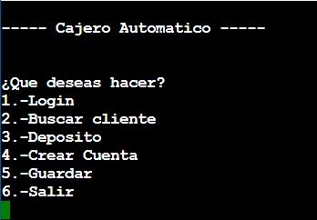
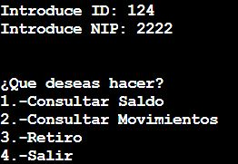
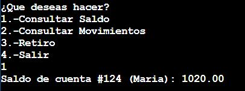
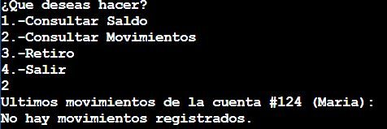
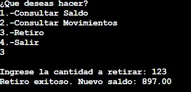
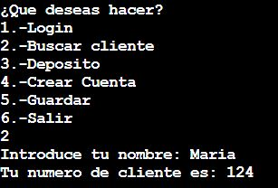
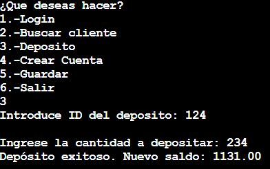
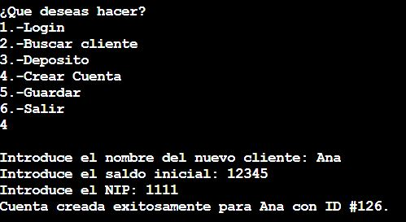
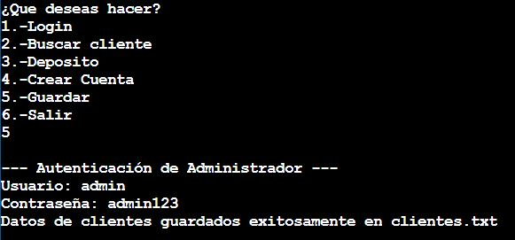

# Guía de Instalación
## Requisitos
* Peso: +9 KB.
* Programas Necesarios: Cualquier compilador de el lenguaje de programación C.
* Contar con una cuenta de Github.

Pasos para la instalación:

1. En la esquina superior derecha de la pagina principal de Github, encontraras varios botones, entre ellos encontraras la barra de búsqueda, haces click sobre ella y deberas escribir **“OmarMendez245”** para luego apretar la tecla “enter”.
Con esto Github te notificara que encontró un usuario con ese nombre.

2. Harás click sobre el aviso, lo que te mostrara el usuario **“OmarMendez245”**, haces click sobre el y se te mostrara su pagina de usuario.


4. En la parte inferior habrá un apartado llamado **“Contribution activity”**, en el que buscaras el mes de mayo de el 2025.

5. Veras que ahí hubo actividad en un enlace con el nombre de **“DanielEmmanuel2005/ATM”**, haz click sobre ese nombre.

6. Encontraras una pagina con una lista de nombres en la parte central de la pantalla, ahí buscaras **“ATM Terminado”** y **"ATM.h"**, haces click sobre ellos y te mostraran todo nuestro código.

7. Crearas un nuevo proyecto en tu compilador de C y pegaras nuestros códigos.

8. Haras click en compilar y luego correras el programa.

# Guía de usuario

Al ejecutar el código se mostrará un texto con el nombre del programa junto al menú principal donde puedes seleccionar las siguientes opciones:



**1.-Login :**
Al seleccionar 1 aparecerá “Introduce ID” donde deberás escribir en NoCliente si este existe pedirá el NIP para comprobar que es tu cuenta, en caso de que el NoCliente y NIP sean incorrectos se regresará al menú principal.
Al ser correcto tanto el NoCliente y el NIP se presentará un nuevo menú con las siguientes opciones:



* Consultar Saldo:
Al seleccionar 1 se mostrará su ID de usuario junto a su nombre y el saldo actual de      
             la cuenta, y regresa al menú.



* Consultar Movimientos:
Al seleccionar 2 si usted no a hecho movimientos previamente se escribira en la pantalla “No hay movimientos registros”, pero si previamente has hecho algún movimiento se mostrarán los últimos 10 movimientos hechos (positivos si son depósitos y negativo si son retiro.Una vez completado cualquier de los dos casos previos se regresará al menú anterior.



* Retiro:
Al seleccionar 3 se pedirá la cantidad a retirar y se valida en dado caso de que su saldo sea insuficiente se pedirá una confirmación para seguir con el retiro si es ‘S’ se le restara y quedará el saldo en negativo y si es ‘N’ se cancelara y regresará directamente al menú.Si tiene el saldo suficiente segura con el retiro y regresa al menú.	



* Salir:
Al seleccionar 4 regresarás al menú principal junto a las primeras opcionesmostradas.

**2.-Buscar cliente:**
Al seleccionar 2 pedirá el nombre de dueño de la cuenta si este no está registrado mostrará “No existe este usuario.” y regresarás al menú principal, pero sí en nombre sí está registrado se mostrará en Nocliente de ese usuario y regresará al menú principal.



**3.-Depósito:**
Al seleccionar 3 pedira el ID o NoCliente de la cuenta al que quieras depositar si este usuario no existe regresarás al menú. Si este existe pedirá la cantidad a depositar a la cuenta y se le sumará y regresas al menú principal. 



**4.-Crear Cuenta:**
Al seleccionar 4 y si existen menos de 100 usuarios se pedirá los datos de la nueva cuenta (nombre, Saldo, Nip) y una vez obtenidos se le asignará un número de cuenta a partir del número 125 y regresas al menú principal.
Si existen 100 usuarios no podrás registrar un nuevo usuario y regresarás al menú principal.



**5.-Guardar:**
Al seleccionar la opción 5, el programa pedirá un usuario y contraseña de administrador para poder acceder a esta función. Si el usuario o contraseña son incorrectos, mostrará un mensaje indicando que el acceso fue denegado y regresará automáticamente al menú principal sin realizar ninguna acción.
Si las credenciales de administrador son correctas, el sistema creará un archivo llamado clientes.txt donde guardará toda la información de los clientes registrados hasta ese momento, incluyendo su número de cliente, nombre, saldo, NIP y movimientos recientes. Una vez completado el guardado de datos, el programa mostrará un mensaje de confirmación y volverá al menú principal para que el usuario pueda seguir realizando otras operaciones.



**6.-Salir:**
Al seleccionar 6  se acabará el programa y se cerrará.

## Estructura del Cliente 
La siguiente estructura representa la información de un cliente del cajero automático.

```c
struct cliente 
{
    char Nombre[40];           // Cadena de caracteres: nombre del cliente
    char Apellido[40];         // Cadena de caracteres: apellido del cliente
    int NoCliente;             // Número entero: ID único del cliente
    int NIP;                   // Número entero: clave de acceso del cliente
    float Saldo;               // Número decimal: saldo disponible en la cuenta
    int Movimientos[10];       // Arreglo de enteros: historial de movimientos
};
```
Caracteristicas de la struct cliente.

* Nombre : Este es un tipo de dato de cadena de caracteres el cual el cliente debe de poner su Nombre al crear la nueva cuenta. 
* Apellido : Este es un tipo de dato de cadena de caracteres el cual el cliente debe de complementar su nombre con el apellido al crear la nueva cuenta.
* NIP : Este es un tipo de dato entero el cual guarda el **NIP** de que el cliente hizo al crear la cuenta.
* Saldo de la cuenta: Este es un tipo de dato float el cual se inicializa en 0 al crear la nueva cuenta.
* Ultimos 10 movimientos en la cuenta : Este es un arreglo de 10 enteros el cual tambien se inicializa en 0 al crear la cuenta, y este dato va a mostrar los ultimos 10 movimientos de la cuenta (Depositos o retiros que se le hicieron a la cuenta).
* Numero del cliente **ID** : Este es un tipo de dato entero el cual es el ID que se le asigna al crear la cuenta.

## Acciones del programa (Funciones del Cajero Automatico)
El programa cuenta con 6 Funciones principales las cuales son las siguientes:
1. CrearCuenta(struct cliente *cliente, int *numCliente)
	```c
	void CrearCuenta(struct cliente *clientes, int *numClientes);
	```
	* Descripción: Funcion sin retorno de valor que registra un nuevo cliente solicitando nombre, apellido, NIP y saldo inicial.
	* Parámetros:
	    * **clientes**: Puntero a un struct cliente.
	    * **numeroCliente**: Puntero a entero que indica el número actual de clientes y se actualiza al agregar uno nuevo.

2. Busqueda(struct cliente *clientes, int tamaño)
	```c
	void Busqueda(struct cliente *clientes, int tamano);
	```
	* Descripción: Funcion sin retorno de valor que permite buscar a un cliente por nombre y muetra su número de cliente.
	* Parámetros:
	    * **clientes**: Arreglo de structs cliente.
		* **tamano**: Número total de clientes registrados.

3. Depositar(struct cliente *clientes, int NumClientes)
	```c
	float Depositar(struct cliente *clientes);
	```
	* Descripción: Permite depositar una cantidad en la cuenta del cliente pasado por referencia. Valida el depósito, actualiza saldo y registra el movimiento.
	* Retorno: Actualiza el saldo del cliente y almacena el movimiento.
	* Parámetros:
	    * **clientes**: Arreglo de structs cliente.

4. ConsultarSaldo(struct cliente cliente)
	```c
	void ConsultarSaldo(struct cliente clientes);
	```
	* Descripción: Funcion sin retorno de valor que imprime el saldo actual del cliente.
	* Parámetros:
	    * **clientes**: Copia de la estructura cliente para consultar su saldo.

5. Retiro(struct cliente *cliente)
	```c
	float Retirar(struct cliente *clientes);
	```
	* Descripción: Permite retirar dinero de la cuenta del cliente, validando que la cantidad sea positiva y preguntando confirmación si el saldo es insuficiente. Actualiza saldo y registra el movimiento..
	* Retorno: Retorna el saldo actualizado.
	* Parámetros:
	    * **clientes**: Puntero a un struct cliente.

6. IniciarSesion(struct cliente *clientes, int numClientes)
	```c
	void IniciarSesion(struct cliente *clientes, int numClientes);
	```
	* Descripción: Solicita ID y NIP para autenticar al cliente. Si los datos son correctos, permite consultar saldo, movimientos o hacer retiros mediante un menú.
	* Retorno: No retorna valor, pero ejecuta acciones sobre la cuenta autenticada.
	* Parámetros:
	    * **clientes**: Puntero a un arreglo de estructuras cliente.
	    * **numClientes**: Número total de clientes registrados.


